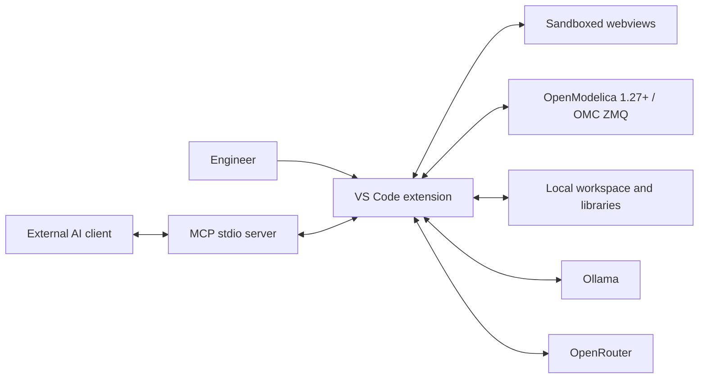
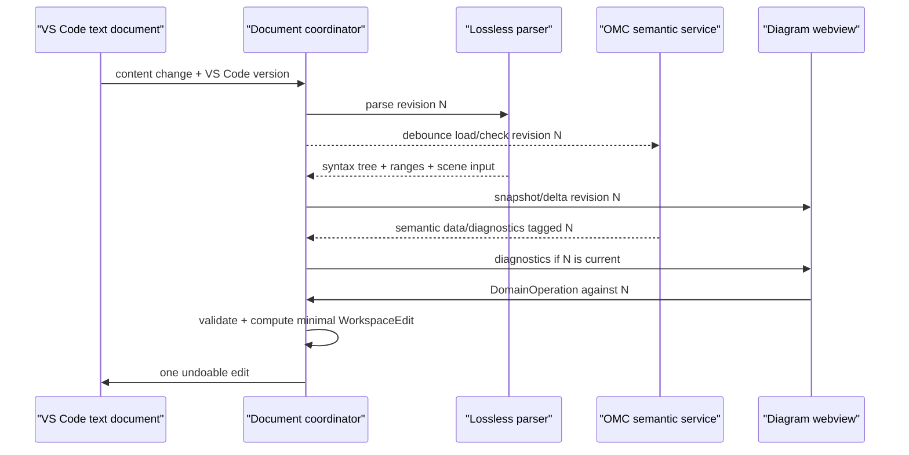

# Technical architecture

## 1. System context



OpenModelica is a mandatory, separately installed runtime. The extension never links OMC libraries or bundles compiler code.

## 2. Runtime processes

### VS Code extension host

Trusted coordinator. Owns documents, file writes, OMC process, simulation processes, secrets, providers, MCP lifecycle, commands, trees, notifications, and all validation.

### Webviews

Untrusted presentation processes for diagram/icon, figures, AI settings/chat, documents, and animation. Use strict CSP, nonce scripts, no inline styles/scripts, no Node integration, and `localResourceRoots`. Webviews request domain operations; they never receive API keys or arbitrary filesystem paths.

### OMC session

One supervised long-lived `omc --interactive=zmq` session per VS Code extension host. A session manager serializes state-mutating calls and permits bounded concurrent read work only if backed by separate ephemeral workers. Phase 1 may serialize all calls for correctness.

### Simulation workers

Each run gets an immutable run ID and isolated directory. Translation and runtime processes have independent cancellation and logs. Never generate into the source directory.

### MCP server

An optional child process over stdio. It authenticates with a per-session random token when bridging to the extension and exposes only registered schemas.

## 3. Package responsibilities

| Package       | Owns                                                            | Must not own                        |
| ------------- | --------------------------------------------------------------- | ----------------------------------- |
| `contracts`   | wire types, domain operations, versioning                       | VS Code or renderer imports         |
| `modelica`    | lossless syntax, ranges, symbols, annotations, patches          | processes, webviews, provider calls |
| `omc`         | discovery, session, scripting API, diagnostics                  | source formatting, UI               |
| `diagram`     | canonical scene graph, transforms, routing, hit tests, commands | filesystem or OMC process           |
| `simulation`  | jobs, results, figures, animation model, debug boundary         | webview state or secrets            |
| `ai`          | provider adapters, context, tool loop, proposals, traces        | direct file edits or shell access   |
| `mcp`         | schemas/resources/session bridge                                | bypassing domain validation         |
| `ui`          | tokens, components, accessible behavior                         | source mutation or secrets          |
| `apps/vscode` | composition and VS Code contribution points                     | core business logic                 |

Dependencies point inward: `apps/vscode -> feature packages -> contracts`. Feature packages may depend on `modelica` contracts but must avoid dependency cycles.

## 4. Document and synchronization model



Rules:

- discard all asynchronous results whose revision is not current;
- a parse failure keeps the last valid scene visible with a stale banner and disables graphical mutation;
- never regenerate a whole class solely to change an annotation;
- use stable IDs derived from source identity plus deterministic disambiguation, not array indices;
- after applying an edit, reparse from actual VS Code document content before acknowledging success.

## 5. Modelica semantic strategy

Use two complementary representations:

1. **Lossless concrete syntax tree:** error-tolerant, retains every token/trivia, supplies precise edits. Evaluate available permissively licensed parsers first; otherwise implement the subset needed for class/component/equation/annotation boundaries and preserve opaque regions.
2. **OMC semantic facade:** authoritative class hierarchy, restrictions, inherited elements, component types, connectors, modifiers, annotations, checks, simulations, and package operations.

Important OMC scripting families include `loadFile`, `loadModel`, `getClassNames`, `getComponents`, `getElements`, `getComponentAnnotations`, `getIconAnnotation`, `getDiagramAnnotation`, `addComponent`, `updateComponent`, `addConnection`, `deleteConnection`, `setElementAnnotation`, `listFile`, `checkModel`, `simulate`, `readSimulationResultVars`, and `readSimulationResult`. Detect exact availability at handshake because API shapes can vary by version.

Prefer reading through OMC but writing through minimal source patches. OMC mutation APIs may be used as an oracle in tests or as a carefully evaluated fallback; do not let OMC rewrite user files without a diff preview because formatting preservation is a product requirement.

## 6. Canonical scene graph

Core types:

- `CoordinateSystem`: extent, preserveAspectRatio, initialScale, grid;
- `Layer`: diagram or icon;
- `ComponentNode`: class reference, instance, Placement, icon instance, connectors;
- `ConnectionEdge`: endpoint references, points, color/pattern/thickness/arrows/smooth;
- primitives: line, polygon, rectangle, ellipse, text, bitmap;
- groups/selection/handles are transient view state, not Modelica state.

All Modelica coordinates are stored unmodified. A pure transform maps Modelica coordinates (positive y upward) to CSS/SVG viewport coordinates (positive y downward). Every rendering/edit test must round-trip the transform within `1e-9` before snapping.

SVG is selected first because Modelica diagrams are vector-heavy, DOM accessibility is useful, and screenshot baselines are deterministic. Use viewport culling and symbol reuse for large scenes. Revisit Canvas/WebGL only after measured failure of budgets.

## 7. OMC lifecycle

State machine:

```text
unconfigured -> discovering -> starting -> handshaking -> loading -> ready
                                          |              |
                                          v              v
                                        failed <------ recovering
```

Handshake captures executable path, `getVersion()`, installation directory, platform, and supported-call capabilities. Required version is >=1.27. A crash rejects in-flight calls with a typed `SessionLost` error, backs off, restarts once automatically, reloads system/user libraries and open files, then reissues only idempotent reads.

Command construction must escape Modelica strings, not shell strings. Spawn the executable directly with an argv array and `shell: false`.

## 8. Simulation/results architecture

`SimulationConfig` includes class, start/stop, interval or count, solver, tolerance, output format, variable filter, compiler flags, simulation flags, and environment. Normalize and validate before OMC calls.

Run manifest states: queued, translating, compiling, running, completed, failed, cancelled. Persist logs and timing. Store relative artifact paths and the exact OMC version/config for reproducibility.

Read MAT v4 incrementally or in a worker thread. Load metadata/variable names first and series on demand. CSV is supported for interoperability but is not the default. Figures refer to a run ID plus variable names rather than embedding result arrays.

VisXML animation belongs in a separate Three.js-based webview in phase 7. Enforce local-resource restrictions and cap asset sizes.

## 9. AI architecture

Provider-neutral interface:

```ts
interface AiProvider {
  listModels(signal: AbortSignal): Promise<ModelInfo[]>;
  stream(request: ChatRequest, signal: AbortSignal): AsyncIterable<AiEvent>;
}
```

The orchestration loop exposes an allowlisted tool registry. Tool execution is split into `read`, `proposeMutation`, and `executeApprovedAction`. Mutating results contain operations, a base revision, a human-readable summary, and a source diff preview. Schema errors and OMC diagnostics are returned to the model in bounded form for repair.

Context selection is explicit and minimal: current class, selected elements, relevant diagnostics, required library signatures, and recent tool results. Never send the entire workspace by default.

## 10. Security boundaries

- CSP and message validation for every webview;
- Zod/JSON Schema validation at webview, AI, MCP, settings-import, and persisted-file boundaries;
- URI allowlists and workspace containment checks;
- direct child-process spawn with fixed executables/argv;
- SecretStorage for OpenRouter key;
- redacted structured logs, disabled by default for AI payloads;
- prompt-injection defense: Modelica comments/library docs/tool output are untrusted data, never instructions;
- size, recursion, timeout, and operation-count limits for parser and AI/MCP calls.

## 11. Suggested dependency policy

Prefer mature permissive dependencies. Initial candidates, subject to license/security review:

- React + SVG for webviews;
- Zustand or explicit reducers for transient view state;
- Zod for runtime schemas;
- `zeromq` for OMC transport, with a verified VS Code/Node 22 packaging test;
- `@modelcontextprotocol/sdk` for MCP;
- uPlot for high-performance plots;
- Three.js for animation;
- Vitest, fast-check, Playwright, and `@vscode/test-electron` for tests.

Pin exact versions in the lockfile and record notices. Do not adopt AGPL/copyleft parser or renderer code without a written license decision.
